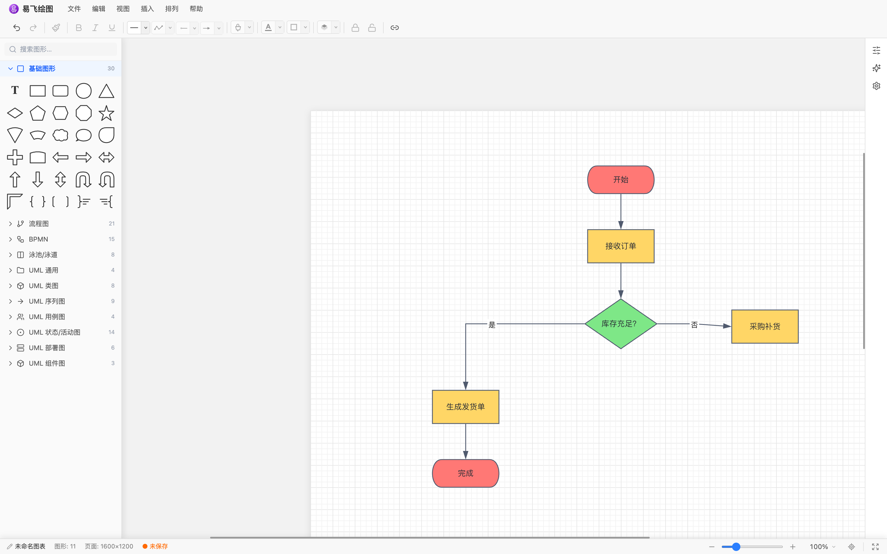
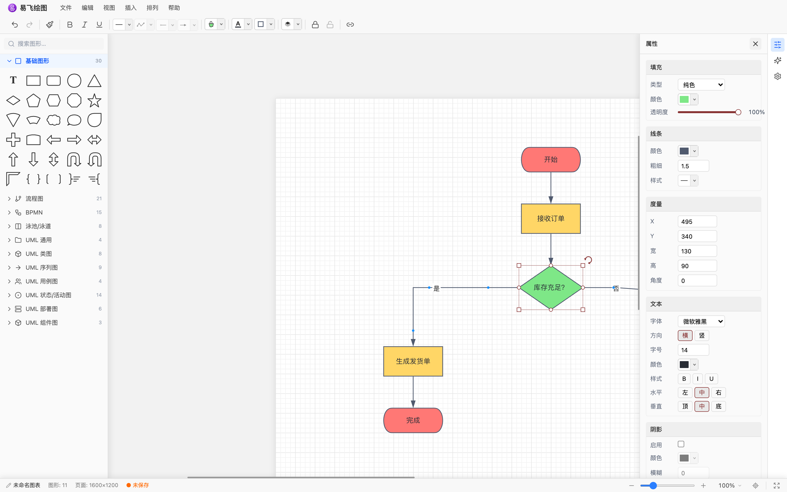
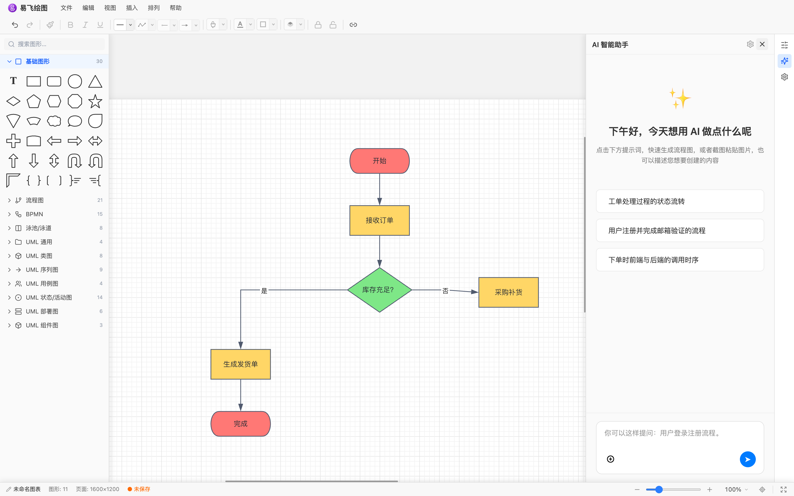

# EFLink Draw 易飞绘图

开箱即用的在线流程图/绘图编辑器。基于 [Konva](https://konvajs.org/) 画布引擎与 React 构建，**既可以独立运行（本仓库 demo 应用），也可以作为 React 组件嵌入任意应用**（npm 包 `@eflink-tech/draw`）。

A diagram & flowchart editor for the web. Run it standalone, or embed `<DrawEditor />` into your React app.

## 截图预览

| 流程图编辑 | 属性面板 | AI 助手 |
| --- | --- | --- |
|  |  |  |

## 功能特性

- 画布引擎：Konva + react-konva，无限画布、缩放平移、网格与分页参考
- 图形库：内置常用图形与流程图/时序图形状，图形注册机制可扩展
- 连线能力：锚点智能连线、折线路由、段中点句柄手动调整、连线随图形移动自动重路由
- 编辑能力：多选/框选、对齐吸附、撤销重做、复制粘贴、组合层级、快捷键
- AI 助手：对话式生成与修改图形（OpenAI 兼容接口，用户自备 API Key 与 BaseURL），支持图片转流程图、自动布局、主题配色、内置模板库
- 持久化：localStorage 快照自动恢复 + IndexedDB（会话/设置/模板），刷新不丢内容
- 导出：画布内容导出 PNG
- 工程化：Vite + TypeScript 严格模式 + Vitest 单测 + Playwright e2e + ESLint

## 使用组件

```bash
npm install @eflink-tech/draw
```

```tsx
import { DrawEditor } from '@eflink-tech/draw';
import '@eflink-tech/draw/styles.css';

function Page() {
  return (
    <div style={{ width: '100vw', height: '100vh' }}>
      <DrawEditor />
    </div>
  );
}
```

组件自带完整编辑器 UI（顶部工具栏、图形面板、属性面板、底部状态栏、AI 助手），挂载后自动恢复上次编辑的文档。

### AI 助手配置

点击左侧「AI 助手」进入设置，填入任意 OpenAI 兼容服务的信息即可使用（Key 仅保存在浏览器 IndexedDB，不会上传到任何第三方）：

- BaseURL：OpenAI 兼容接口地址（如 `https://api.openai.com/v1`）
- API Key：对应服务的密钥
- 模型：对话与视觉模型名称

不配置 AI 时，编辑器的全部手工绘图功能不受影响。

### 导出面

- `DrawEditor`：编辑器组件
- `useEditorStore`：zustand 状态（文档、选中集、视口等），可用于程序化操作图形
- `saveDocumentToStorage / loadDocumentFromStorage / isDocumentData / STORAGE_KEY`：localStorage 快照持久化
- `createEmptyDocument`、`DocumentData`：文档数据模型

> **Tailwind 说明**：组件库内部布局用到少量 Tailwind 工具类（已随 `styles.css` 提供回退样式）。若宿主使用 Tailwind v4 且希望得到与 demo 一致的布局，请在入口 CSS 中显式扫描组件包：
>
> ```css
> @import "tailwindcss";
> @source "../node_modules/@eflink-tech/draw";
> ```

## 本地运行 Demo

```bash
pnpm install
pnpm dev          # 并行：组件库 watch 构建 + demo dev server
# 或
pnpm dev:demo     # 仅 demo（直连组件库源码，无需先构建）
```

打开终端提示的地址即为完整独立应用：图形面板、连线编辑、AI 助手、PNG 导出、自动保存，开箱即用。

## 命令速查

```bash
pnpm lint         # ESLint（monorepo 全量）
pnpm typecheck    # TypeScript 严格类型检查
pnpm test         # Vitest 单元测试
pnpm build        # 构建组件库 + demo
pnpm test:e2e     # Playwright 端到端（生产构建 + preview）
```

## 目录结构

```
eflink-draw/
├── packages/draw/      # @eflink-tech/draw 组件库（开源主体）
│   └── src/
│       ├── components/ # UI 组件（画布/面板/菜单/AI 助手/导出）
│       ├── core/       # 编辑器内核（文档操作、连线路由、图形 schema、持久化）
│       ├── ai/         # AI 助手（服务调用、动作执行、自动布局、模板）
│       ├── store/      # zustand 编辑器状态
│       └── types/      # 数据模型
├── apps/demo/          # 独立 demo 应用（易飞绘图）
├── e2e/                # Playwright 端到端测试
└── scripts/            # CI 发布辅助脚本
```

## 发版流程

使用 [Changesets](https://github.com/changesets/changesets) 管理版本：

```bash
pnpm changeset    # 记录变更（选择包与版本级别）
git push          # 推送后机器人自动开 Version PR
# 合并 Version PR → 自动发布 npm 并打 tag
```

## 联系我们

- **在线体验**：<https://eflink.tech>（易飞绘图 · 免费在线流程图 / 示意图绘制）
- **问题反馈与交流**：[eflink.tech/contact](https://eflink.tech/contact)
- **邮箱**：[support@eflink.tech](mailto:support@eflink.tech)

使用微信或企业微信扫码添加（二维码长期有效）：

<p align="center">
  
</p>

## License

[MIT](./LICENSE) © 2026 eflink-tech
